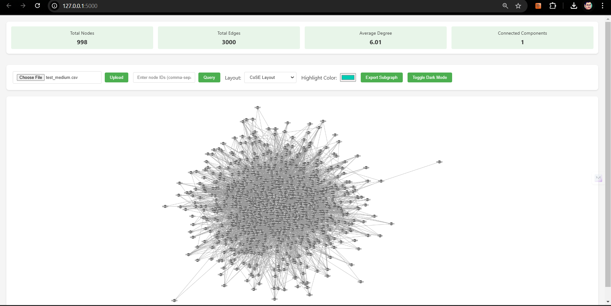
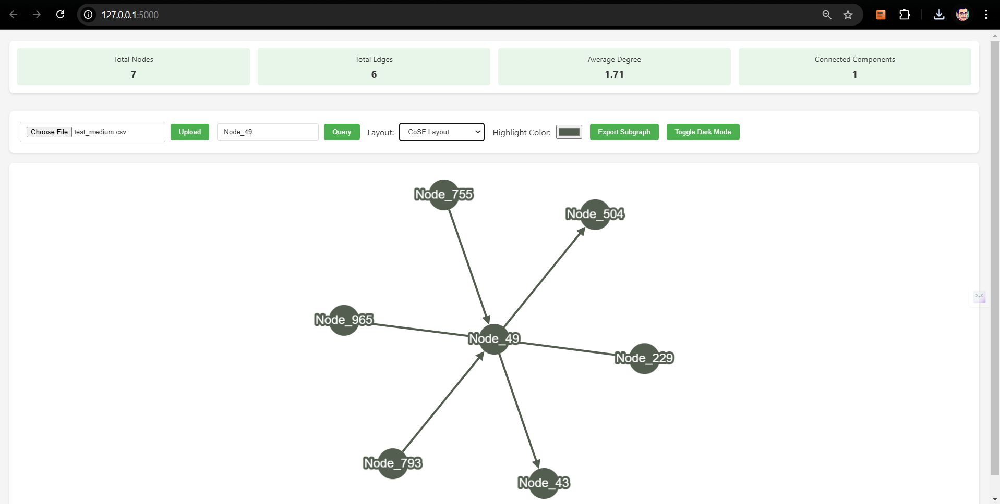
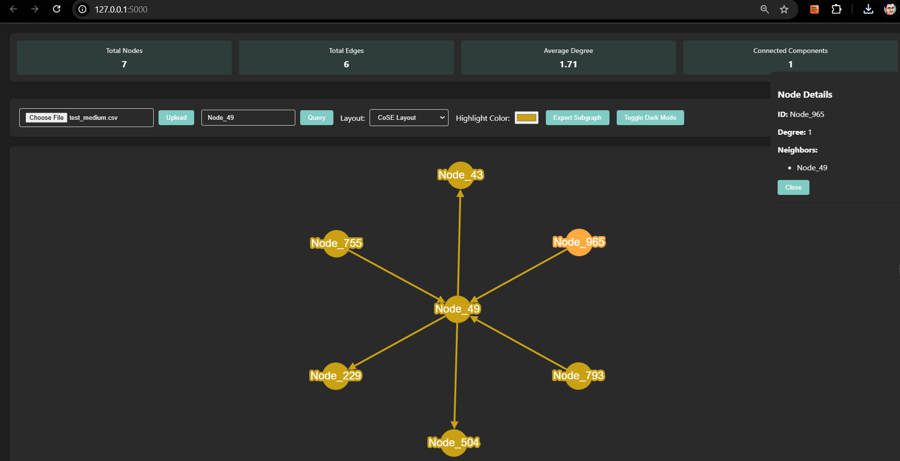
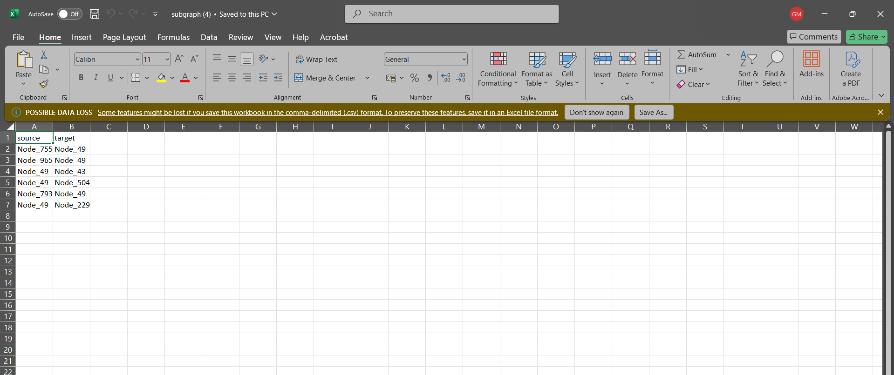

# Network Visualization Web Application

A Flask-based web application for visualizing large networks using Cytoscape.js. This application enables users to upload, query, and interactively explore network graphs with support for multiple file formats and visualization options.

## Interface Preview

Here's what you can expect when running the application:

### Full Network View

*Visualization of a medium-sized network with 998 nodes and 3000 edges*

### Subgraph Query Results

*Result of querying Node_49 showing first-degree neighbors*

### Dark Mode View

*Dark mode visualization with custom highlight colors*

### Exported Subgraph

*CSV format of exported subgraph data*

## Features

The application provides powerful network visualization capabilities including:

- Upload and parse SIF, TSV/CSV files with automatic format detection
- Error handling for invalid file formats and data validation
- Query-based visualization of nodes and their first-degree neighbors
- Interactive visualization with multiple layout algorithms (Grid, Circle, CoSE)
- Dark mode support for comfortable viewing
- Subgraph extraction and export functionality
- Real-time network statistics and metrics

## Directory Structure

```
NRNB-VIS-APP/
│
├── app.py                 # Flask application entry point
├── generate_large_csv.py  # Test data generation script
├── README.md             # This documentation
├── LICENSE               # MIT License file
│
├── templates/
│   └── index.html        # Main application template
│
├── static/
│   ├── app.js            # Client-side application logic
│   ├── style.css         # Application styling
│   └── images/           # Screenshot directory for README
│       ├── full_network.png
│       ├── subgraph_query.png
│       ├── dark_mode.png
│       └── exported_subgraph.png
│
└── test_data/            # Generated test networks
    ├── test_small.csv
    ├── test_medium.csv
    ├── test_large.csv
    └── test_xlarge.csv
```

## Installation & Setup

1. **Install Python 3** if not already installed
   - Windows: Download from [python.org](https://python.org)
   - macOS: `brew install python3`
   - Linux: `sudo apt install python3` (Ubuntu/Debian) or `sudo dnf install python3` (Fedora)

2. **Clone the Repository**
   ```bash
   git clone https://github.com/yourusername/NRNB-VIS.git
   cd NRNB-VIS
   ```

3. **Create a Virtual Environment**
   
   Windows:
   ```bash
   python -m venv venv
   venv\Scripts\activate
   ```
   
   macOS/Linux:
   ```bash
   python3 -m venv venv
   source venv/bin/activate
   ```

4. **Install Dependencies**
   ```bash
   pip install flask
   ```

## Generating Test Data

1. **Generate Test Networks**
   
   Windows:
   ```bash
   python generate_large_csv.py
   ```
   
   macOS/Linux:
   ```bash
   python3 generate_large_csv.py
   ```

2. **Push Generated Files** (if using Git)
   ```bash
   # Create test_data directory if it doesn't exist
   mkdir -p test_data
   
   # Move generated files to test_data directory
   mv test_*.csv test_data/
   
   # Add and commit the files
   git add test_data/*.csv
   git commit -m "Add test network data files"
   git push origin main
   ```

   Note: If your test files are large, consider adding them to `.gitignore` and providing the generation script instead.

## Running the Application

1. **Start the Flask Server**
   
   Windows:
   ```bash
   python app.py
   ```
   
   macOS/Linux:
   ```bash
   python3 app.py
   ```

2. Open your browser and navigate to [http://127.0.0.1:5000/](http://127.0.0.1:5000/)

## Usage Guide

### Network Upload

1. Click the "Choose File" button and select your network file
2. Supported formats:
   - CSV/TSV with header row containing "source" and "target" columns
   - SIF format: `source interaction target1 target2 ...`
   - TXT files with appropriate structure

### Network Visualization

1. **View Full Network**
   - Networks with <5,000 nodes display automatically
   - Larger networks require querying Subgraph to avoid performance issues

2. **Query Specific Nodes**
   - Enter node IDs in the query box (comma or space-separated)
   - Click "Query" to visualize selected nodes and their neighbors

3. **Customize Visualization**
   - Choose different layouts from the dropdown menu
   - Toggle dark mode for better visibility
   - Select highlight colors for queried subgraphs

4. **Export Options**
   - Download current subgraph as CSV

### Interactive Features

- Double-click nodes to view detailed information
- Drag nodes to adjust layout
- Zoom and pan to explore large networks
- Use the color picker to highlight specific subgraphs

## Troubleshooting

- **File Format Issues**: Ensure your CSV/TSV has the correct header format
- **Performance Problems**: Use the query feature for large networks
- **Memory Errors**: Clear browser data or use smaller input files

## License

This project is licensed under the MIT License - see the LICENSE file for details.


